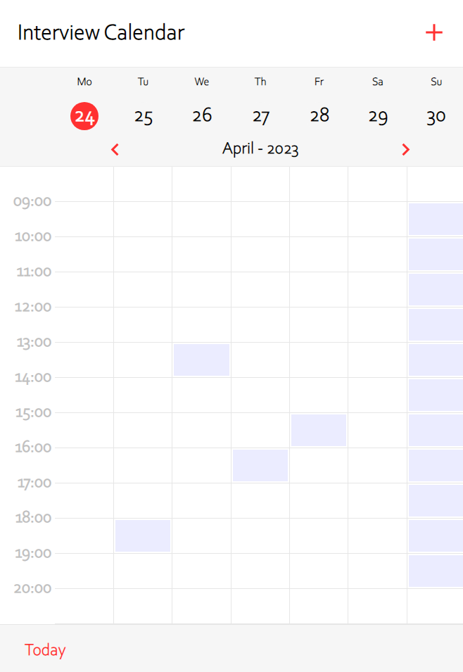
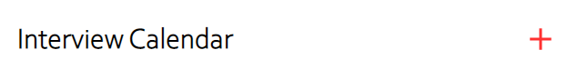
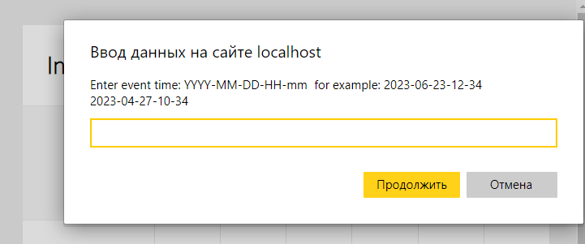
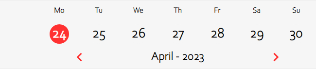
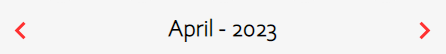
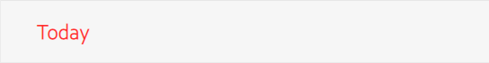
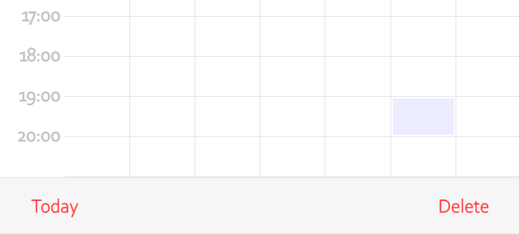

# Interview-calendar.

#### Недельный календарь(встреч, дел или чего угодно) по часам.
* `deploy:` https://interview-calendar-two.vercel.app/



 


---

#### Установка зависимостей:
```md
npm install
```

#### Запуск приложения:
```md
npm run start
```

---

### UI
+ Добавление события через интерфейс браузера - `prompt`
  
  
  * для быстрого добавления события можно использовать dblClick или ctrl+click
+ Дни недели, даты, месяц и год. 

  

+ Навигация (из настоящего в прошлое и будуще) 😃

  
  
+ Кнопка перехода на текущую неделю (возврат в настоящее)

    

+ При выборе добавленного события появляется кнопка его удаления

  
---

### Технологии и библиотеки
- React.ts, Redux-toolkit
- Git, GitHub
- [Styled-components](https://styled-components.com/)
- [moment.js](https://momentjs.com/)

---

[](https://forthebadge.com)
